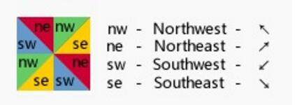

One 使用(border)创建三角 icon 实例:

向上:
#triangle-up {
    width: 0;
    height: 0;
    border-left: 50px solid transparent;
    border-right: 50px solid transparent;
    border-bottom: 100px solid red;
}

向下:
#triangle-down {
    width: 0;
    height: 0;
    border-left: 50px solid transparent;
    border-right: 50px solid transparent;
    border-top: 100px solid red;
}

向左:
#triangle-left {
    width: 0;
    height: 0;
    border-top: 50px solid transparent;
    border-right: 100px solid red;
    border-bottom: 50px solid transparent;
}

向右:
#triangle-right {
    width: 0;
    height: 0;
    border-top: 50px solid transparent;
    border-left: 100px solid red;
    border-bottom: 50px solid transparent;
}

向 左上:
#triangle-topleft {
    width: 0;
    height: 0;
    border-top: 100px solid red;
    border-right: 100px solid transparent;
}

向 右上:
#triangle-topright {
    width: 0;
    height: 0;
    border-top: 100px solid red;
    border-left: 100px solid transparent; 
}

向 左下:
#triangle-bottomleft {
    width: 0;
    height: 0;
    border-bottom: 100px solid red;
    border-right: 100px solid transparent;
}

向 右下:
#triangle-bottomright {
    width: 0;
    height: 0;
    border-bottom: 100px solid red;
    border-left: 100px solid transparent;
}

Two 使用(border)创建三角 icon 实例:
html:

向上的三角形

    

        
    

                                                      

向下的三角形

    

        
    

                                                      

向左的三角形

    

        
    

                                                      

向右的三角形

    

        
    

CSS:
向上

    .triangle_border_up{
        width:0;
        height:0;
        border-width:0 30px 30px;
        border-style:solid;
        border-color:transparent transparent #333;/*透明 透明  灰*/
        margin:40px auto;
        position:relative;
    }
    .triangle_border_up span{
        display:block;
        width:0;
        height:0;
        border-width:0 28px 28px;
        border-style:solid;
        border-color:transparent transparent #fc0;/*透明 透明  黄*/
        position:absolute;
        top:1px;
        left:-28px;
    }

向下

    .triangle_border_down{
        width:0;
        height:0;
        border-width:30px 30px 0;
        border-style:solid;
        border-color:#333 transparent transparent;/*灰 透明 透明 */
        margin:40px auto;
        position:relative;
    }
    .triangle_border_down span{
        display:block;
        width:0;
        height:0;
        border-width:28px 28px 0;
        border-style:solid;
        border-color:#fc0 transparent transparent;/*黄 透明 透明 */
        position:absolute;
        top:-29px;
        left:-28px;
    }

向左

    .triangle_border_left{
        width:0;
        height:0;
        border-width:30px 30px 30px 0;
        border-style:solid;
        border-color:transparent #333 transparent transparent;/*透明 灰 透明 透明 */
        margin:40px auto;
        position:relative;
    }
    .triangle_border_left span{
        display:block;
        width:0;
        height:0;
        border-width:28px 28px 28px 0;
        border-style:solid;
        border-color:transparent #fc0 transparent transparent;/*透明 黄 透明 透明 */
        position:absolute;
        top:-28px;
        left:1px;
    }

向右

    .triangle_border_right{
        width:0;
        height:0;
        border-width:30px 0 30px 30px;
        border-style:solid;
        border-color:transparent transparent transparent #333;/*透明 透明 透明 灰*/
        margin:40px auto;
        position:relative;
    }
    .triangle_border_right span{
        display:block;
        width:0;
        height:0;
        border-width:28px 0 28px 28px;
        border-style:solid;
        border-color:transparent transparent transparent #fc0;/*透明 透明 透明 黄*/
        position:absolute;
        top:-28px;
        left:-29px;

(2)东北、东南、西北、西南三角形的写法

    html:
        

        

    CSS:
    .triangle_border_nw{
        width:0;
        height:0;
        border-width:30px 30px 0 0;
        border-style:solid;
        border-color:#6c6 transparent transparent transparent;
        margin:40px auto;
        position:relative;
    }
    .triangle_border_nw{
        width:0;
        height:0;
        border-width:0 0 30px 30px;
        border-style:solid;
        border-color:transparent transparent transparent #6c6;
        margin:40px auto;
        position:relative;
    }

